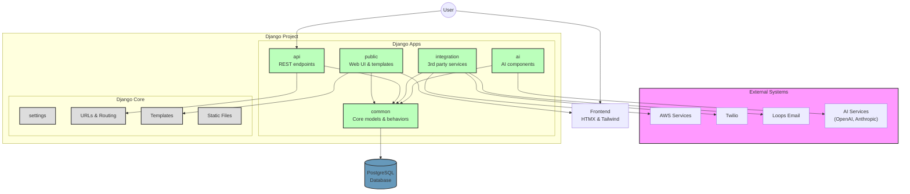

# Django Project Template Architecture

This document outlines the architecture of the Django Project Template, showing the relationships between different apps and components.

## App Structure

The project is organized into several Django apps, each with a specific responsibility:

- **common**: Core models, utilities, and reusable components used across the system
- **public**: Front-end website and user interface components
- **api**: RESTful API endpoints
- **integration**: Third-party service integrations
- **ai**: AI model integrations and utilities (planned)

## Architecture Diagram

## App Relationships and Dependencies

### Common App
- Foundation of the system with shared models and behaviors
- Provides core functionality like User model, behavior mixins, and utilities
- Used by all other apps

### Public App
- Consumes Common app models and behaviors
- Generates HTML interfaces using templates and HTMX
- Handles user interface logic and sessions

### API App
- Consumes Common app models
- Exposes REST endpoints using Django REST Framework
- Provides serializers for data transformation

### Integration App
- Interfaces with third-party services:
  - AWS: File storage and services
  - Twilio: SMS messaging
  - Loops: Transactional email
- Abstracts external API details behind a clean interface

### AI App (Planned)
- Will integrate with AI service providers
- Will provide abstractions for prompts and completions
- Will include agent frameworks for advanced AI workflows

## Data Flow

1. **User Requests**:
   - Web requests route through Public app views
   - API requests route through API app views

2. **Data Access**:
   - Apps access data through Common app models
   - Models leverage behavior mixins for standard functionality

3. **External Interactions**:
   - Communication with external services happens through Integration app
   - Integration app provides a consistent interface for service access

4. **Frontend Rendering**:
   - Templates and static files provide frontend structure
   - HTMX handles dynamic frontend interactions
   - Tailwind CSS v4 with django-tailwind-cli provides styling

## Technology Stack

- **Backend**: Django, DRF, PostgreSQL
- **Frontend**: HTMX, Tailwind CSS v4 with django-tailwind-cli
- **External Services**: AWS, Twilio, Loops
- **AI Integration**: OpenAI, Anthropic (planned)
- **Deployment**: Docker, Render